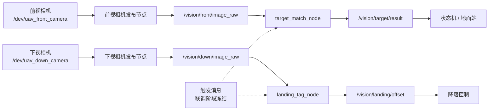

# 无人机比赛视觉感知工作流程与目标

## 1. 文档定位

- 文档用途：视觉模块后续开发、调试和验收的执行基线。
- 目标平台：NUC `flag-NUC12WSK-B`，Ubuntu 20.04.6，ROS1 Noetic。
- 主工作空间：`/home/flag/Jiangyin2026`。
- 新增两个包：纯消息包 `uav_vision_msgs` 和算法实现包 `uav_vision`。
- 本阶段只定义视觉模块，不修改飞行规划、飞控状态机和地面站。

## 2. 比赛视觉任务

视觉模块包含两个相互独立的任务。

### 2.1 降落区域对准

下视摄像头识别降落区域的 5 个 AprilTag。只有 5 个指定标签全部被识别时，检测结果才有效。

本任务只计算图像平面上的像素偏差：

1. 取得每个标签的像素中心 `detection->c`。
2. 对 5 个标签中心求平均，得到降落区域中心：

   ```text
   landing_center_x = sum(tag_center_x) / 5
   landing_center_y = sum(tag_center_y) / 5
   ```

3. 计算它与图像中心的偏差：

   ```text
   dx = landing_center_x - image_width / 2
   dy = landing_center_y - image_height / 2
   ```

4. 图像坐标约定为：右方 `dx > 0`，下方 `dy > 0`。

本方案不使用相机标定参数、标签实际边长、PnP 三维位姿或 TF。飞控使用偏差前，需在联调阶段明确相机安装方向及控制符号转换。

### 2.2 墙面目标分类

前视摄像头识别 `plane`、`car`、`ship`、`house` 四张固定图片。比赛现场从四张图片中随机选择两张，单张目标尺寸约为 `0.4 m × 0.4 m`。

该任务属于固定模板匹配，不使用神经网络。四张模板只能从比赛规则 PDF 中提取。

已确认的现场条件如下：

- 每次识别时，前视相机画面主要出现一个目标板。
- 目标图片打印在约 `0.4 m × 0.4 m` 的正方形纸张或板材上，纸张或板材与墙面之间存在可见的方形外沿。
- 正式目标不包含图 5 中的黑色方框，也不包含 `plane`、`car`、`ship`、`house` 英文文字。
- 识别时目标板基本正对相机、完整可见，不要求处理大角度斜视、部分出画或遮挡。
- 目标板在 `1280 × 720` 图像中的实际像素尺寸尚未测定，调焦和安装完成后通过实拍确定。

## 3. 已确认的 NUC 和摄像头状态

### 3.1 计算平台

- CPU：12th Gen Intel Core i7-1260P。
- 内存：约 16 GiB。
- GPU：Intel 核显，无 NVIDIA GPU。
- OpenCV：4.2.0。
- AprilTag C 库：`libapriltag 0.10.0`。
- Python 环境没有 PyTorch、ONNX Runtime、OpenVINO 或 Ultralytics；本项目不依赖这些组件。

### 3.2 摄像头设备

两个摄像头均为 `LRCP V1080P`，VID/PID、产品名和序列号相同。每个摄像头生成两个 video 节点，其中只有 `video-index0` 具备采集能力。

当前 USB 物理路径为：

```text
/dev/v4l/by-path/pci-0000:00:14.0-usb-0:3:1.0-video-index0  # 前视，墙面四分类
/dev/v4l/by-path/pci-0000:00:14.0-usb-0:2:1.0-video-index0  # 下视，AprilTag
```

检查时它们分别指向 `/dev/video0` 和 `/dev/video2`，但 `/dev/videoX` 编号可能在重启或重新插拔后改变。

禁止在正式配置中直接使用：

```text
/dev/video0
/dev/video2
/dev/v4l/by-id/*
```

两路摄像头实测均可协商以下 MJPG 模式：

- `640 × 480 @ 30 FPS`
- `1280 × 720 @ 30 FPS`
- `1920 × 1080 @ 30 FPS`

两路相机均已由用户通过浏览器实时画面完成调焦，并确认 USB 路径
`usb-0:3:1.0-video-index0` 对应前视相机，
`usb-0:2:1.0-video-index0` 对应下视相机。

### 3.3 udev 固定命名

两台相机的型号、VID/PID、产品名和序列号完全相同，无法按相机本体身份可靠区分。
比赛期间保证两根 USB 线始终连接当前物理端口，因此按 `ID_PATH` 和
`ATTR{index}=="0"` 固定功能角色。规则文件为：

```text
/etc/udev/rules.d/99-uav-cameras.rules
```

文件内容：

```udev
SUBSYSTEM=="video4linux", ENV{ID_PATH}=="pci-0000:00:14.0-usb-0:3:1.0", ATTR{index}=="0", SYMLINK+="uav_front_camera", GROUP="video", MODE="0660"
SUBSYSTEM=="video4linux", ENV{ID_PATH}=="pci-0000:00:14.0-usb-0:2:1.0", ATTR{index}=="0", SYMLINK+="uav_down_camera", GROUP="video", MODE="0660"
```

其中 `ATTR{index}=="0"` 排除同一 UVC 相机生成的非采集 video 节点。规则生成：

```text
/dev/uav_front_camera
/dev/uav_down_camera
```

启动文件只引用这两个固定名称。安装规则后执行：

```bash
sudo udevadm control --reload-rules
sudo udevadm trigger --subsystem-match=video4linux
udevadm settle
```

验收时依次检查：

1. 两个软链接均存在，且分别解析到具备 `:capture:` 能力的节点。
2. 前视软链接显示墙面分类相机画面，下视软链接显示降落相机画面。
3. 两路能够分别以 `1280 × 720`、MJPG、30 FPS 连续取流。
4. 热插拔后软链接恢复且角色不变。
5. 冷启动后软链接恢复且角色不变。
6. `/dev/videoX` 编号发生变化时，两个功能软链接仍指向正确角色。

该规则固定的是 USB 端口角色，不是摄像头本体。两个摄像头的线缆不得互换；如重新布线，必须重新执行前视/下视画面确认。

## 4. 既有代码评估

### 4.1 可复用部分

`apriltag_ros` 中可以参考或提取：

- `libapriltag` 的链接方式。
- `tag36h11` family 的创建和销毁。
- BGR 到灰度图的转换。
- AprilTag detector 的参数设置和生命周期管理。
- 重复标签 ID 的过滤逻辑。
- `apriltag_detection_t::c` 像素中心和 `p` 四角坐标。

`apriltag_echo_message` 中只保留“汇总多个标签后取中心均值”的思路。

### 4.2 不复用部分

以下旧逻辑与新方案目标不一致，不应带入新包：

- `CameraInfo` 同步。
- 相机内参读取。
- 标签实际尺寸配置。
- `solvePnP`、三维位姿和四元数。
- 标签三维偏移数组。
- TF 发布和坐标变换。
- 持续发布上一次有效位姿。

旧 `apriltag_echo_message` 对标签 ID 数组边界、零检测除法和无效结果处理不安全，新包需要重新实现严格的有效性判断。

### 4.3 当前工程状态

- `/home/flag/Jiangyin2026/src/apriltag_ros`
- `/home/flag/Jiangyin2026/src/apriltag_echo_message`
- `/home/flag/Jiangyin2026/src/plane_Det`

以上三个包当前均有 `CATKIN_IGNORE`。

`plane_Det` 是激光点云障碍识别包，不是墙面图片分类包。现有工作空间中没有可直接使用的墙面图片分类代码或模型。

## 5. 推荐软件架构

采用“独立消息契约 + 标准 ROS 图像话题 + 两个独立节点 + 公共算法库”的结构。

解耦原则：

- `uav_vision_msgs` 只定义视觉输出消息，只依赖 ROS 消息生成工具和 `std_msgs`。
- `uav_vision` 依赖 `uav_vision_msgs`，负责算法和 ROS 节点。
- 飞控、状态机和地面站只需依赖 `uav_vision_msgs`，不需要依赖 OpenCV、`libapriltag`、模板文件或视觉实现代码。
- `uav_vision` 不包含其他业务包的头文件，不直接调用其他业务包的函数，也不硬编码它们的自定义消息。
- C++ 节点内部使用相对话题名，由 launch 文件 remap 到最终系统话题。
- 触发消息的类型、话题和状态值尚未冻结。后续通过薄适配层把任务系统的触发消息转换为视觉节点的启停事件，不让算法核心依赖任务状态机。
- 第一开发顺序是先完成并验证输出消息包，再实现算法和触发适配。



建议的新包目录：

```text
uav_vision_msgs/
├── CMakeLists.txt
├── package.xml
└── msg/
    ├── LandingOffset.msg
    ├── TargetMatch.msg
    └── TargetMatchArray.msg

uav_vision/
├── CMakeLists.txt
├── package.xml
├── include/uav_vision/
│   ├── landing_tag_detector.hpp
│   ├── target_matcher.hpp
│   └── temporal_filter.hpp
├── src/
│   ├── landing_tag_detector.cpp
│   ├── landing_tag_node.cpp
│   ├── target_matcher.cpp
│   └── target_match_node.cpp
├── config/
│   ├── cameras.yaml
│   ├── landing_tag.yaml
│   └── target_match.yaml
├── launch/
│   ├── cameras.launch
│   └── uav_vision.launch
├── udev/
│   └── 99-uav-cameras.rules
├── templates/
│   ├── plane.png
│   ├── car.png
│   ├── ship.png
│   └── house.png
└── test/
```

算法类不直接依赖 ROS 消息，使其可以对普通图片、录制视频和 rosbag 进行离线测试。

两路相机图像由上游 `usb_cam` 节点发布，`uav_vision` 不重复实现 UVC 驱动。NUC 当前未安装 `usb_cam`，实施阶段需安装与 ROS Noetic 匹配的版本，并由 `cameras.launch` 传入固定的 udev 设备名、MJPG、分辨率、帧率和话题命名空间。

## 6. ROS 接口

### 6.1 输入话题

```text
/vision/front/image_raw
/vision/down/image_raw
```

摄像头发布节点始终运行。算法节点在独立调试阶段允许持续处理；接入任务状态机后，根据感知模式启停计算，降低比赛过程中不必要的 CPU 占用。

触发接口暂不固定消息类型和状态值。算法独立开发时使用私有参数 `always_enabled=true` 持续处理图像，用于验证输出消息；进入状态机联调前，再冻结触发消息契约和超时语义。触发适配不得改变本节定义的输出消息。

### 6.2 降落偏差消息

`uav_vision_msgs/LandingOffset.msg` 第一版固定为：

```text
std_msgs/Header header
bool valid
float32 dx
float32 dy
float32 center_x
float32 center_y
uint8 tag_count
int32[] tag_ids
```

输出话题：

```text
/vision/landing/offset
/vision/landing/debug_image
```

无效帧必须发布 `valid=false`。控制端不得使用无效帧中的 `dx`、`dy`，也不得沿用旧结果。

输入订阅队列和结果发布队列均设为 1，始终优先处理最新图像，处理能力不足时允许丢弃旧帧。输出 `header.stamp` 和 `frame_id` 继承输入图像。

### 6.3 分类结果消息

`uav_vision_msgs/TargetMatch.msg` 表示一个类别候选，第一版固定为：

```text
string label
float32 score
float32 gray_score
float32 hog_score
float32 color_score
float32 margin
float32 sharpness
uint16 target_side_px
float32[8] corners
```

`label` 只允许：

```text
plane
car
ship
house
```

字段定义：

- `score`：范围 `[0, 1]` 的组合评分，由灰度、HOG 和 HSV 三项子分数按 YAML 权重得到。
- `gray_score`、`hog_score`、`color_score`：范围 `[0, 1]` 的三项模板相似度子分数。
- `margin`：最佳类别得分与第二名类别得分之差。
- `sharpness`：归一化目标区域的拉普拉斯清晰度，用于调试和阈值分析。
- `target_side_px`：原图中目标板的代表性像素边长，用于确认有效识别距离和最小尺寸阈值。
- `corners`：目标投影四边形的四个 `(x, y)` 图像坐标；无法形成合理四边形时不得发布为有效候选。

`uav_vision_msgs/TargetMatchArray.msg` 第一版固定为：

```text
std_msgs/Header header
bool valid
uav_vision_msgs/TargetMatch[] matches
```

根据已确认的飞行观察方式，单帧最多输出一个稳定候选。B1、B2 的两个目标在飞行过程中依次识别，由任务状态机或地面站跨时间去重记录。没有稳定结果时发布 `valid=false` 和空数组。

消息必须满足：

```text
valid == true  <=>  matches.size() == 1
valid == false <=>  matches.empty()
```

稳定后逐输入帧发布一次结果；只有当前帧仍通过单帧拒识时才允许发布 `valid=true`。`TargetMatch` 中的分数、清晰度、像素边长和四角坐标均来自当前输入帧，不使用投票窗口中的历史最大值或均值。结果消息的 `header.stamp` 和 `frame_id` 继承当前输入图像。

输出话题：

```text
/vision/target/result
/vision/target/debug_image
```

`/vision/target/result` 类型为 `uav_vision_msgs/TargetMatchArray`。地面站或任务状态机负责按类别和时间去重，记录已经稳定识别的两个目标。

两个 debug 话题均使用 `sensor_msgs/Image`、`bgr8` 编码，继承原图时间戳和 `frame_id`，队列长度为 1。正式比赛可关闭 debug 发布。

### 6.4 构建和运行依赖

`uav_vision_msgs` 只依赖：

- `std_msgs`
- `message_generation`
- `message_runtime`

`uav_vision` 明确依赖：

- ROS：`roscpp`、`roslib`、`std_msgs`、`sensor_msgs`、`cv_bridge`、`image_transport`、`uav_vision_msgs`。
- 相机运行时：ROS Noetic 对应的 `usb_cam`。
- 系统库：OpenCV 4.2、`libapriltag` 及其开发头文件。

模板运行时路径通过 `ros::package::getPath("uav_vision")/templates` 或参数指定，不依赖当前工作目录。

## 7. 降落检测算法

### 7.1 处理流程

1. 接收下视相机图像。
2. 转换为灰度图。
3. 调用 `libapriltag` 检测标签。
4. 过滤非目标 family 和非目标 ID；额外的无关标签不影响结果。
5. 如果任一目标 ID 出现重复检测，当前帧无效。
6. 检查检测到的目标 ID 集合是否与配置的 5 个目标 ID 完全一致。
7. 对 5 个 `detection->c` 求像素均值。
8. 计算 `dx`、`dy`。
9. 对中心坐标执行固定长度的滑动中值滤波。
10. 发布结果和调试图像。

### 7.2 配置项

`landing_tag.yaml` 至少包含：

- `tag_family`
- `expected_ids`
- `threads`
- `decimate`
- `blur`
- `refine_edges`
- `max_hamming`
- `min_decision_margin`
- `filter_window`
- `max_pixel_jump`
- `filter_reset_frames`
- `publish_debug_image`

旧配置使用 `tag36h11`。正式实现前需要用实际打印标签确认 family 和 5 个 ID；该确认不涉及相机标定或标签长度。

### 7.3 有效性规则

- 5 个目标 ID 全部出现、无重复，且每个检测同时满足 `hamming <= max_hamming` 和 `decision_margin >= min_decision_margin`：`valid=true`。
- 少于 5 个目标、出现目标 ID 重复或任一检测不满足上述质量阈值：`valid=false`。
- 额外出现的非目标 ID 在过滤后忽略，不影响有效性。
- 首次有效前不输出控制偏差。
- 检测丢失后立即无效，不允许无限期保持上次结果。
- 与滤波中心相比跳变超过 `max_pixel_jump` 时，当前帧发布 `valid=false`；原始值只保留在日志和调试图像中。
- 连续无效帧达到 `filter_reset_frames` 后清空滤波窗口，重新等待有效序列。

五标签像素均值代表降落区域中心，依赖 5 个标签在实际降落板上按固定、对称布局安装。该几何假设必须通过实际打印板目视确认。无标定方案同时接受镜头畸变带来的小量像素误差，并通过闭环、多帧对准逐步消除偏差。

`filter_window` 必须为正奇数，第一版默认值为 5。`LandingOffset.center_x/center_y` 发布滤波后的中心，`dx/dy` 由该滤波中心计算；未滤波的原始中心只出现在调试图像和日志中。窗口尚未填满时，对当前已有的有效样本求中值。

## 8. 四图多模板匹配算法

第一版采用“方形目标板定位、透视归一化、多模板组合评分、拒识和多帧投票”的流程。ORB 和 RANSAC 不属于第一版实现范围。若现场测试证明方形外沿定位不稳定，应先记录失败数据并单独设计备用定位方案，不允许实施者自行把旧 ORB 流程混入第一版评分。

### 8.1 基础模板提取

优先从 PDF 中直接提取嵌入图像；无法直接提取时，以高分辨率渲染 PDF 后裁剪。每个类别保留一张基础模板：

```text
plane
car
ship
house
```

基础模板只保留实际打印的图片内容，必须排除页面中的英文类别文字和示意黑框。四张基础模板统一裁剪并缩放到固定尺寸，第一版使用 `256 × 256`。原始裁剪图、裁剪范围和预处理参数一并保存，保证模板来源和部署结果可复现。

基础模板和运行时候选必须调用同一个预处理函数：按配置比例裁去四周、缩放到 `256 × 256`，再生成灰度图、HOG 和 HSV 直方图。禁止模板只缩放而运行时候选额外裁边，避免预处理不对称。

### 8.2 多模板库

每个类别由一张基础模板生成约 12～20 张增强模板，覆盖实际打印和相机成像中的有限变化：

- 亮度、对比度和 Gamma 变化。
- 轻微色偏。
- 轻度高斯模糊。
- 约 `±3°` 的小旋转。
- 少量缩放和裁剪误差。

不生成大角度透视模板，因为运行时已经根据目标板四角执行透视归一化。增强模板由基础模板和 YAML 参数确定性生成，不手工维护大量派生图片。YAML 中保存完整的增强参数元组列表，每个元组明确亮度、对比度、Gamma、色偏、模糊、旋转、缩放和裁剪值；生成过程不使用随机数。模板数量等于参数元组数量，因此相同基础模板和 YAML 必须生成完全相同的模板库。节点启动时为每张增强模板预计算归一化灰度图、HOG 描述子和 HSV 颜色直方图。

### 8.3 方形目标板定位

1. 接收前视相机图像。
2. 灰度化并轻度降噪。
3. 使用 Canny 提取边缘和闭合轮廓。
4. 将轮廓近似为多边形，筛选完整、凸的四边形。
5. 根据候选面积、边长比例、四角角度、边缘完整度和是否完全位于画面内进行过滤。
6. 按几何质量保留少量候选，第一版最多保留 5 个。
7. 将每个候选四角按左上、右上、右下、左下的顺时针顺序排列，并执行透视变换，归一化到 `256 × 256`。
8. 去掉归一化图像四周约 3%～5% 的区域，降低纸张外沿和墙面像素的影响，再恢复到统一比较尺寸。

这里使用的是纸张或板材与墙面之间的物理方形外沿，不依赖图 5 中的黑色示意边框。最终候选不能简单按面积选择；每个几何候选都进入模板评分，选择模板证据最强且通过拒识条件的候选，降低窗户、门框等矩形背景造成的误检。

第一版先使用 Canny、轮廓和多边形近似，不增加 Hough 直线或背景分割。只有实拍数据证明外沿经常断裂时，才加入备用定位方法。

`target_side_px` 定义为候选四条边在原始图像中的像素长度均值。候选面积、边长比例、角度和边缘完整度的计算方法与阈值全部写入配置或算法单元测试，不以未记录的经验常量存在。

### 8.4 单帧多模板评分

对每个归一化候选和每张增强模板计算三项分数，并统一映射到 `[0, 1]`：

- `gray_score`：对 `256 × 256` 灰度图使用 OpenCV `TM_CCOEFF_NORMED`。相关系数 `r` 按 `(r + 1) / 2` 映射到 `[0, 1]`；非有限结果记为 0。
- `hog_score`：使用固定参数的 OpenCV HOG，初始参数为窗口 `256 × 256`、块 `32 × 32`、块步长 `16 × 16`、单元 `16 × 16`、9 个方向 bin 和 L2-Hys 归一化。候选与模板描述子的余弦相似度作为 `[0, 1]` 分数。
- `color_score`：在 HSV 空间计算 H-S 二维直方图，初始使用 H 32 个 bin、S 32 个 bin，并执行 L1 归一化。使用 OpenCV `HISTCMP_CORREL` 得到相关系数 `r`，再按 `(r + 1) / 2` 映射到 `[0, 1]`；非有限结果记为 0。

第一版组合评分为：

```text
template_score =
    0.50 * gray_score +
    0.30 * hog_score +
    0.20 * color_score
```

上述权重是实测前的初始值，必须放入 YAML 配置，并只根据调参集调整。一个类别包含多张增强模板，该类别的分数取模板库中的最高 `template_score`。对于同一个四边形候选：

- `best_score` 是四个类别分数中的最高值。
- `second_score` 是该候选四个类别分数中的第二高值。
- `best_label` 是 `best_score` 对应的类别。
- `margin = best_score - second_score`。

最终单帧结果同时满足以下条件才进入时间投票：

```text
best_score >= min_class_score
best_score - second_score >= min_class_margin
```

第一项拒绝与四类都不相似的画面，第二项拒绝类别证据接近、无法可靠区分的画面。阈值必须使用实际打印件和前视相机数据确定。

每个四边形候选先独立执行上述类别内拒识。若没有候选通过，单帧结果为 `unknown`；若只有一个候选通过，使用该候选；若多个候选通过，先按 `best_score` 排序。最高候选必须比第二候选至少高 `min_candidate_margin`，否则当前帧仍为 `unknown`。因此类别 `margin` 只比较同一候选内的四个类别，`min_candidate_margin` 只比较不同空间候选的最佳分数。

### 8.5 单帧拒识条件

出现以下任一情况时，当前帧分类结果为 `unknown`，不得沿用上一帧类别：

- 没有检测到完整、有效的四边形。
- 目标板像素边长小于 `min_target_side_px`。
- 拉普拉斯清晰度低于 `min_sharpness`。清晰度固定定义为：公共预处理完成后的 `256 × 256` 灰度图，使用 `CV_64F`、核大小 3 的 Laplacian 响应方差。
- 透视归一化结果的尺寸、裁剪区域或有效像素异常。
- 所有类别的最佳分数都低于 `min_class_score`。
- 第一名与第二名分差小于 `min_class_margin`。

目标板在 `1280 × 720` 图像中的像素尺寸尚未确定。调焦和安装完成后，先记录不同飞行位置下的目标板边长分布，再冻结 `min_target_side_px`；在此之前不得把临时像素阈值作为最终比赛参数。

### 8.6 多帧稳定输出

- 投票窗口保存最近 `vote_window` 个输入帧；`unknown` 帧占据窗口位置但不投给任何类别。
- 票数最高的类别必须是唯一第一名，且票数达到 `min_stable_votes`，才形成稳定类别；平票时不形成稳定结果。
- 当前帧必须仍检测到该稳定类别并通过单帧拒识，不能只凭历史票数继续发布。
- 连续 `unknown` 帧达到 `target_lost_frames` 后立即清空整个投票窗口；不同类别的有效帧按普通票进入窗口，不因单帧类别变化立即清空。
- 单帧最多发布一个稳定候选；B1、B2 的两个目标由任务状态机或地面站跨时间去重。
- 达到稳定条件后，只要当前帧仍通过上述条件，就随每个输入帧重复发布 `valid=true`；下游按类别和时间去重。
- 调试图像显示目标板四边形、类别、总分、三项子分数、类别分差、候选分差和拒识原因。

### 8.7 配置项

`target_match.yaml` 至少包含：

- 模板生成参数：归一化尺寸、亮度、对比度、Gamma、色偏、模糊、旋转和缩放范围。
- 方形定位参数：Canny 阈值、轮廓面积范围、边长比例、角度容差、候选数量和边缘裁剪比例。
- 质量参数：`min_target_side_px`、`min_sharpness`。
- 评分参数：灰度、HOG、HSV 权重、`min_class_score`、`min_class_margin`、`min_candidate_margin`。
- 时间参数：`vote_window`、`min_stable_votes`、`target_lost_frames`。
- 调试参数：是否发布调试图像和详细评分日志。

## 9. 开发工作流程

### 阶段 0：输出消息契约

1. 建立纯消息包 `uav_vision_msgs`。
2. 实现 `LandingOffset.msg`、`TargetMatch.msg` 和 `TargetMatchArray.msg`。
3. 完成消息生成配置和依赖声明。
4. 使用 `rosmsg show` 检查字段。
5. 使用 `rostopic pub` 模拟视觉节点发布结果，验证潜在消费者无需依赖 `uav_vision`。

阶段输出：

- 可以独立构建的 `uav_vision_msgs`
- 已冻结的第一版视觉输出消息
- 消息发布和订阅烟雾测试记录

### 阶段 1：硬件和设备固定

1. 调整两路摄像头焦距和安装角度。
2. 确认 USB 物理路径与前视、下视角色。
3. 创建并验证 udev 规则。
4. 确定正式采集分辨率、帧率和 MJPG 格式。

阶段输出：

- `/dev/uav_front_camera`
- `/dev/uav_down_camera`
- 两路清晰、方向正确的稳定画面

### 阶段 2：模板和离线测试数据

1. 从 PDF 提取四张模板。
2. 按固定参数生成亮度、对比度、Gamma、色偏、轻微旋转、缩放和模糊增强模板。
3. 使用实际前视相机拍摄屏幕或打印件。
4. 录制下视相机的五标签测试视频。

阶段输出：

- 四张标准模板
- 可重复使用的正样本、负样本和边界场景

### 阶段 3：脱离 ROS 的算法核心

1. 实现 AprilTag 五中心像素偏差。
2. 实现方形目标板定位、透视归一化和多模板组合评分。
3. 对保存的图片和视频执行自动化测试。
4. 确定初始阈值。

阶段输出：

- `landing_tag_detector`
- `target_matcher`
- 离线测试结果

### 阶段 4：ROS1 封装

1. 建立 `uav_vision` 功能包。
2. 依赖 `uav_vision_msgs`，添加节点、配置和 launch 文件。
3. 接入两路标准图像话题。
4. 发布结果和调试图像。
5. 支持 rosbag 回放。

阶段输出：

- 可独立启动和测试的新视觉功能包

### 阶段 5：状态机和地面站联调

1. 冻结触发消息类型、话题、状态值、去抖和超时语义。
2. 用薄适配层把任务系统触发消息转换为视觉启停事件。
3. 确认 `dx`、`dy` 到飞控横纵向控制的符号。
4. 确认分类结果传送和两个目标去重方式。
5. 增加超时、无效结果和节点异常处理。

阶段输出：

- 视觉结果可被任务状态机和地面站稳定消费

### 阶段 6：场地验证

1. 测试不同光照、距离、偏航角和飞行振动。
2. 测试标签短暂遮挡时立即无效。
3. 测试四分类中的易混淆场景。
4. 冷启动并完整跑通比赛流程。

## 10. SSH 远程开发与调试

### 10.1 当前连接信息

```text
NUC IP：10.1.77.193
用户名：flag
当前密码：flag
主机名：flag-NUC12WSK-B
工作空间：/home/flag/Jiangyin2026
```

密码属于当前局域网开发凭据，不应提交到公开代码仓库。正式比赛部署前建议改用 SSH 密钥并更换弱密码。

### 10.2 Windows PowerShell 连接

先检查网络和 SSH 端口：

```powershell
ping 10.1.77.193
Test-NetConnection -ComputerName 10.1.77.193 -Port 22
```

连接 NUC：

```powershell
ssh flag@10.1.77.193
```

第一次连接时核对主机地址后输入 `yes` 接受主机指纹，再输入密码 `flag`。输入密码时终端不显示字符，这是正常现象。

登录后确认主机：

```bash
hostname
whoami
source /opt/ros/noetic/setup.zsh
rosversion -d
```

预期分别包含：

```text
flag-NUC12WSK-B
flag
noetic
```

### 10.3 每个 SSH 终端的环境初始化

NUC 的登录 shell 环境变量可能显示 `/bin/bash`，但当前 SSH 交互进程会进入
zsh。以当前进程为准，不要只看 `$SHELL`：

```bash
ps -p $$ -o comm=
```

输出 `zsh` 时执行：

```bash
cd /home/flag/Jiangyin2026
source /opt/ros/noetic/setup.zsh
source devel/setup.zsh
```

输出 `bash` 时执行：

```bash
cd /home/flag/Jiangyin2026
source /opt/ros/noetic/setup.bash
source devel/setup.bash
```

首次构建、`devel` 尚未生成或新消息尚未构建时，先只加载 ROS：

```bash
cd /home/flag/Jiangyin2026
source /opt/ros/noetic/setup.zsh
```

### 10.4 第一阶段消息包构建

将 `uav_vision_msgs` 放入：

```text
/home/flag/Jiangyin2026/src/uav_vision_msgs
```

在 NUC 上构建：

```bash
cd /home/flag/Jiangyin2026
source /opt/ros/noetic/setup.zsh
catkin_make --pkg uav_vision_msgs
source devel/setup.zsh
```

验证消息是否生成：

```bash
rosmsg show uav_vision_msgs/LandingOffset
rosmsg show uav_vision_msgs/TargetMatch
rosmsg show uav_vision_msgs/TargetMatchArray
```

### 10.5 消息发布烟雾测试

第一个 SSH 终端启动 ROS master：

```bash
source /opt/ros/noetic/setup.zsh
roscore
```

第二个 SSH 终端加载工作空间并模拟发布降落偏差：

```bash
cd /home/flag/Jiangyin2026
source /opt/ros/noetic/setup.zsh
source devel/setup.zsh
rostopic pub -1 /vision/landing/offset uav_vision_msgs/LandingOffset \
'{header: {seq: 0, stamp: {secs: 0, nsecs: 0}, frame_id: "down_camera"}, valid: true, dx: 12.0, dy: -8.0, center_x: 652.0, center_y: 352.0, tag_count: 5, tag_ids: [0, 1, 2, 3, 4]}'
```

第三个 SSH 终端验证接收：

```bash
cd /home/flag/Jiangyin2026
source /opt/ros/noetic/setup.zsh
source devel/setup.zsh
rostopic echo -n 1 /vision/landing/offset
```

分类结果采用相同方式对 `/vision/target/result` 进行发布和订阅测试。消费者只需要 source 工作空间并依赖 `uav_vision_msgs`，不需要安装或链接视觉算法库。

### 10.6 从 Windows 复制文件

如需从本地工作区复制消息包到 NUC，可在 Windows PowerShell 执行：

```powershell
scp -r E:\code\uav\uav_vision_msgs flag@10.1.77.193:/home/flag/Jiangyin2026/src/
```

复制前应确认目标目录，不覆盖 NUC 上其他人的同名修改。后续若建立 Git 仓库，优先通过分支和提交同步代码。

### 10.7 常见连接问题

- `Connection timed out`：检查电脑和 NUC 是否在同一网络、IP 是否变化、22 端口和 Wi-Fi 终端隔离。
- `Connection refused`：在 NUC 本地检查 `sudo systemctl status ssh`。
- `Permission denied`：确认用户名和密码，或检查 SSH 密钥。
- NUC 地址变化：在 NUC 本地执行 `hostname -I` 获取当前 IPv4 地址。
- NUC 重装系统后主机指纹变化：先人工确认确实是目标 NUC，再执行 `ssh-keygen -R 10.1.77.193` 删除旧指纹。

## 11. 初始验收目标

以下是第一版工程目标，实测后允许调整，但调整需要记录原因。

离线数据必须按完整录制片段分组划分为调参集和最终验收集，同一录制片段的任何帧不得跨集合。阈值只根据调参集确定，最终验收集不得用于反复调参。

### 11.1 设备和启动

- 连续 10 次冷启动后，前视和下视角色保持正确。
- 两路相机均能稳定输出，不依赖 `/dev/videoX` 编号。
- 启动失败时给出明确错误，不静默运行。

### 11.2 AprilTag 降落偏差

- 在远、中、近三个高度及正常、偏暗两种光照下，各采集不少于 300 帧；5 个标签完整、清晰可见时，总有效检测率和每个条件的有效检测率均不低于 95%。
- 少于 5 个目标标签时，`valid` 必须为 `false`。
- 在 `1280 × 720` 输入下，目标处理频率不低于 15 Hz。
- 使用固定的五标签角点人工标注规范；滤波后检测中心与人工标注中心的平均像素误差不高于 5 px。
- 不读取相机内参和标签物理尺寸。

### 11.3 四图分类

- 每类至少采集 100 帧，覆盖距离、偏航角、俯仰角、正常/偏暗光照和轻度运动模糊；另采集至少 200 帧非目标负样本。
- 负样本应包含墙面、门框、窗户、普通正方形纸张和其他可能形成四边形的背景。
- 调参前统计各测试位置的目标板像素边长和清晰度分布，据此确定最小目标尺寸和清晰度阈值。
- 帧级统计以目标板完整进入画面后的每个输入帧为单位；正样本输出 `unknown` 计为漏检，输出错误类别计为误分类，正确类别计为正确。
- 四类帧级总体准确率及每类召回率均不低于 95%。
- 负样本帧发布 `valid=true` 的比例不高于 2%。
- 对证据不足的画面发布空结果，并在调试信息中标记 `unknown`。
- 从目标四边形首次完整进入画面开始计时，1 秒内给出稳定结果。
- 延迟按完整录制片段分别统计，每个片段从目标板首次完整进入画面到第一次正确稳定输出为止；片段内出现任何错误稳定类别应单独记为严重失败。
- 在 `1280 × 720` 输入下，目标处理频率不低于 10 Hz。
- 分类结果不能依赖 PDF 中的类别文字或图 5 的黑色示意边框。

## 12. 调试和记录要求

每次测试至少记录：

- Git 或文件版本标识。
- 相机固定设备名、分辨率和帧率。
- YAML 参数。
- 输入图片、视频或 rosbag 名称。
- 检测率、误识别、处理频率和延迟。
- 失败画面及原因分类。

调试图像只用于开发和地面检查，比赛正式运行时允许通过参数关闭，避免无谓的图像编码和网络传输。

## 13. 明确不在本阶段范围内的内容

- 神经网络训练和推理。
- AprilTag 三维位姿估计。
- 相机内参标定。
- 标签实际边长测量。
- 双目、深度估计或视觉里程计。
- 修改飞行规划器、PX4 控制器或地面站界面。

## 14. 实施前现场确认项

这些项目不会改变总体架构，但必须在相应开发阶段开始前确认：

1. 实际打印 AprilTag 的 family 和 5 个 ID。
2. 前视相机观察目标时的典型距离、角度和目标画面占比。
3. 状态机用于启停两种视觉任务的模式值或话题。
4. 飞控消费 `dx`、`dy` 时的方向符号。
5. 地面站接收分类结果的最终消息或转发接口。
